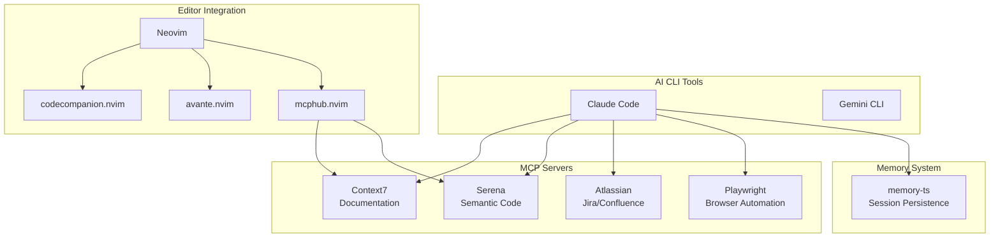
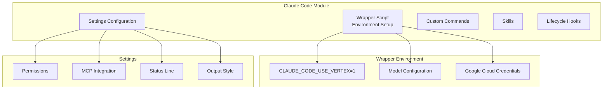
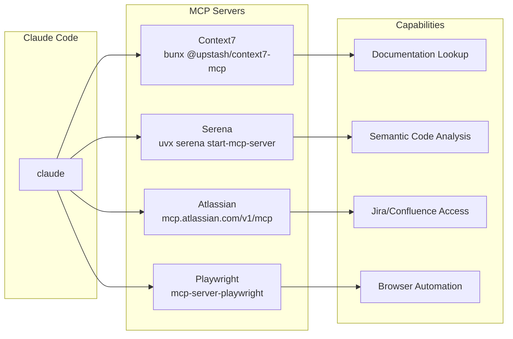
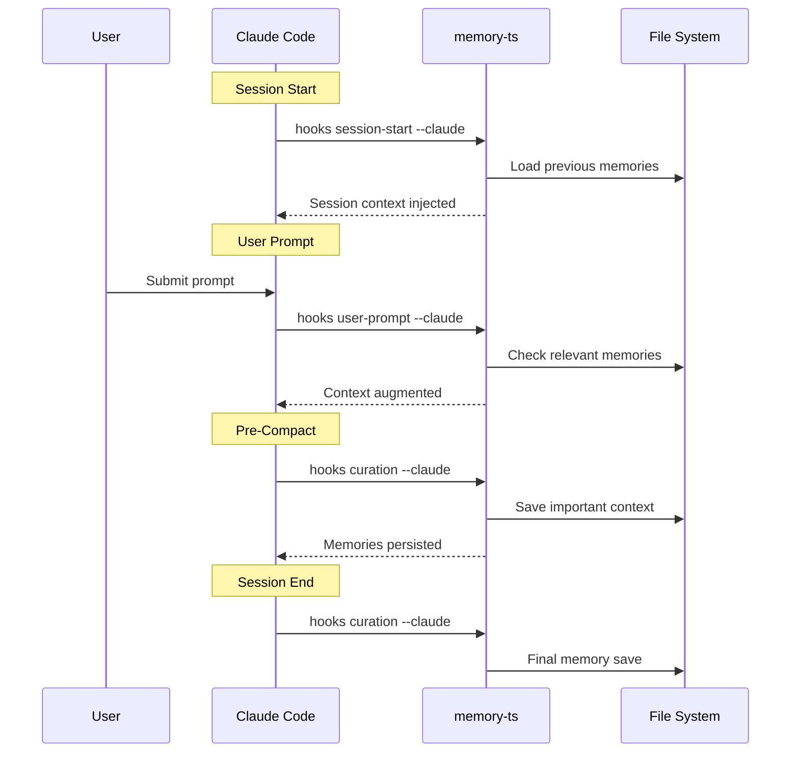
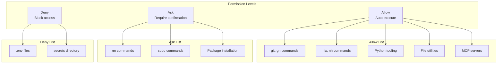
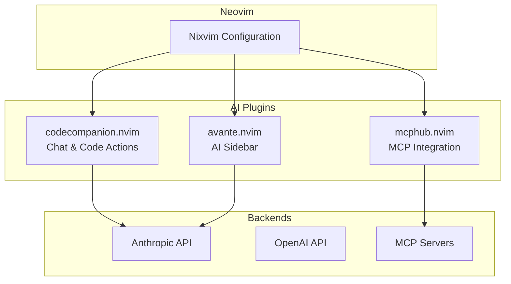

# AI & MCP Integration Architecture

This document provides detailed documentation of the AI tooling ecosystem integrated into this dotfiles repository, including Claude Code, Gemini CLI, and MCP (Model Context Protocol) servers.

## Table of Contents

- [Overview](#overview)
- [Claude Code Integration](#claude-code-integration)
- [MCP Server Configuration](#mcp-server-configuration)
- [Memory System](#memory-system)
- [Skills & Commands](#skills--commands)
- [Permissions System](#permissions-system)
- [Gemini CLI](#gemini-cli)
- [Neovim AI Integration](#neovim-ai-integration)

---

## Overview

### AI Tooling Stack



### Module Locations

| Component | Location |
|-----------|----------|
| Claude Code | `modules/home-manager/ai/claude-code/` |
| Gemini CLI | `modules/home-manager/ai/gemini-cli/` |
| MCP Config | `modules/home-manager/ai/mcp/` |
| Playwright | `modules/home-manager/playwright/` |
| Neovim AI Plugins | `modules/home-manager/neovim/plugins/` |

---

## Claude Code Integration

### Architecture



### Wrapper Script

The Claude Code wrapper sets up the Vertex AI environment:

```bash
# Environment variables set by wrapper
export ENABLE_TOOL_SEARCH=true
export CLAUDE_CODE_USE_VERTEX=1
export ANTHROPIC_DEFAULT_OPUS_MODEL=claude-opus-4-5@20251101
export ANTHROPIC_DEFAULT_SONNET_MODEL=claude-sonnet-4-5@20250929
export ANTHROPIC_DEFAULT_HAIKU_MODEL=claude-haiku-4-5@20251001
export GOOGLE_APPLICATION_CREDENTIALS=$SOPS_SECRETS_DIR/serviceAccounts/ai  # managed by sops-nix
export GOOGLE_CLOUD_PROJECT=lv-playground-genai
export CLOUD_ML_REGION=global
```

### Configuration Options

```nix
programs.claude-code = {
  enable = true;
  package = claudeWrapper;           # Custom wrapper
  enableMcpIntegration = true;       # Enable MCP servers
  commandsDir = ./commands;          # Custom commands directory

  settings = {
    model = "opus";                  # Default model
    cleanupPeriodDays = 30;          # Session cleanup
    outputStyle = "Explanatory";     # Response style
    alwaysThinkingEnabled = true;    # Extended thinking

    env = {
      DISABLE_AUTOUPDATER = "1";
      DISABLE_TELEMETRY = "1";
      DISABLE_ERROR_REPORTING = "1";
    };

    enableAllProjectMcpServers = true;

    statusLine = {
      type = "command";
      command = "~/.claude/ccline/ccline";
      padding = 0;
    };
  };
};
```

### Agents Helper

The `agents` script provides tmux-based agent launching:

```bash
# Usage
agents <plugin-name> [prompt]

# Example: Launch code-review plugin
agents code-review "Review this PR"

# What it does:
# 1. Creates/uses 'claude-agents' tmux session
# 2. Opens new window
# 3. Resets enabled plugins
# 4. Installs specified plugin
# 5. Runs Claude with --dangerously-skip-permissions
```

---

## MCP Server Configuration

### Server Architecture



### Server Definitions

```nix
programs.mcp.servers = {
  # Documentation lookup via Context7
  context7 = {
    command = "${pkgs.bun}/bin/bunx";
    args = [ "@upstash/context7-mcp@latest" ];
  };

  # Semantic code analysis via Serena
  serena = {
    command = "${pkgs.uv}/bin/uvx";
    args = [
      "--from=git+https://github.com/oraios/serena"
      "serena"
      "start-mcp-server"
      "--open-web-dashboard=false"
      "--context=claude-code"
      "--project-from-cwd"
    ];
  };

  # Atlassian integration (HTTP-based)
  atlassian = {
    url = "https://mcp.atlassian.com/v1/mcp";
  };

  # Playwright browser automation
  playwright = mkIf config.modules.playwright.enable {
    command = "${pkgs.playwright-mcp}/bin/mcp-server-playwright";
    args = [
      "--output-dir=${dataDir}"
      "--storage-state=${dataDir}/state.json"
    ];
  };
};
```

### Context7 Server

**Purpose**: Retrieve up-to-date documentation and code examples for libraries.

**Tools Available**:
- `resolve-library-id`: Resolve library name to ID
- `query-docs`: Query documentation for a library

**Usage Example**:
```
Claude, look up the React useEffect documentation using Context7
```

### Serena Server

**Purpose**: Semantic code analysis and navigation.

**Tools Available**:
- `list_dir`, `find_file`, `search_for_pattern`: File navigation
- `get_symbols_overview`, `find_symbol`, `find_referencing_symbols`: Symbol analysis
- `replace_symbol_body`, `insert_after_symbol`, `insert_before_symbol`: Code editing
- `rename_symbol`: Refactoring
- `read_memory`, `write_memory`, `list_memories`: Memory persistence

**Key Features**:
- Project-aware context (`--project-from-cwd`)
- Optimized for Claude Code context (`--context=claude-code`)
- Symbolic editing for precise code modifications

### Playwright Server

**Purpose**: Browser automation for testing and web interaction.

**Tools Available**:
- `browser_navigate`, `browser_click`, `browser_type`: Navigation
- `browser_take_screenshot`, `browser_snapshot`: Capture
- `browser_fill_form`, `browser_file_upload`: Forms
- `browser_evaluate`, `browser_run_code`: JavaScript execution

**Configuration**:
```nix
# Platform-specific Chromium paths set via playwright module
executablePath = if pkgs.stdenv.isDarwin
  then "${pkgs.playwright-driver.browsers}/chromium-.../chrome-mac-arm64/..."
  else "${pkgs.playwright-driver.browsers}/chromium-.../chrome-linux/chrome";
```

---

## Memory System

### Lifecycle Hooks Architecture



### Hook Configuration

```nix
hooks = {
  # Session lifecycle
  SessionStart = [{
    matcher = "startup|resume";
    hooks = [{
      type = "command";
      command = "${pkgs.bun}/bin/bunx github:idjoo/memory-ts hooks session-start --claude";
      timeout = 10;
    }];
  }];

  # Prompt processing
  UserPromptSubmit = [{
    hooks = [{
      type = "command";
      command = "${pkgs.bun}/bin/bunx github:idjoo/memory-ts hooks user-prompt --claude";
      timeout = 10;
    }];
  }];

  # Memory curation before context compaction
  PreCompact = [{
    matcher = "auto|manual";
    hooks = [{
      type = "command";
      command = "${pkgs.bun}/bin/bunx github:idjoo/memory-ts hooks curation --claude";
      timeout = 10;
    }];
  }];

  # Session end curation
  SessionEnd = [{
    matcher = "auto|manual";
    hooks = [{
      type = "command";
      command = "${pkgs.bun}/bin/bunx github:idjoo/memory-ts hooks curation --claude";
      timeout = 10;
    }];
  }];

  # Notifications
  Notification = [{
    matcher = "";
    hooks = [ notify ];
  }];

  Stop = [{
    hooks = [ notify ];
  }];
};
```

### Memory Types

The memory system supports categorized memories:

| Type | Symbol | Description |
|------|--------|-------------|
| Breakthrough | 💡 | Major insights or discoveries |
| Decision | ⚖️ | Architectural or design decisions |
| Personal | 💜 | User preferences and context |
| Technical | 🔧 | Technical implementation details |
| State | 📍 | Current project state |
| Unresolved | ❓ | Open questions or blockers |
| Preference | ⚙️ | User preferences |
| Workflow | 🔄 | Workflow patterns |
| Architecture | 🏗️ | System architecture notes |
| Debug | 🐛 | Debugging information |
| Philosophy | 🌀 | Design philosophy |
| Todo | 🎯 | Action items |
| Implementation | ⚡ | Implementation notes |
| Solved | ✅ | Resolved issues |
| Project | 📦 | Project-level context |
| Milestone | 🏆 | Project milestones |

---

## Skills & Commands

### Skills Architecture

```mermaid
graph TB
    subgraph "Skills Directory"
        SKL[~/.claude/skills/]
    end

    subgraph "Available Skills"
        CTX7_SKL[context7/<br/>SKILL.md]
        PW_SKL[playwright/<br/>SKILL.md]
        TMUX_SKL[tmux/<br/>SKILL.md]
    end

    subgraph "Activation"
        SLASH[/context7, /playwright, /tmux]
    end

    SKL --> CTX7_SKL
    SKL --> PW_SKL
    SKL --> TMUX_SKL

    CTX7_SKL --> SLASH
    PW_SKL --> SLASH
    TMUX_SKL --> SLASH
```

### Skill Locations

```nix
# Skills are symlinked from dotfiles to ~/.claude/skills/
home.file.".claude/skills/context7".source =
  config.lib.file.mkOutOfStoreSymlink
    "${config.home.homeDirectory}/dotfiles/modules/home-manager/ai/claude-code/skills/context7";

home.file.".claude/skills/playwright".source =
  config.lib.file.mkOutOfStoreSymlink
    "${config.home.homeDirectory}/dotfiles/modules/home-manager/ai/claude-code/skills/playwright";

home.file.".claude/skills/tmux".source =
  config.lib.file.mkOutOfStoreSymlink
    "${config.home.homeDirectory}/dotfiles/modules/home-manager/ai/claude-code/skills/tmux";
```

### Custom Commands

Commands are loaded from `./commands/`:

| Command | File | Description |
|---------|------|-------------|
| `/commit` | `commands/commit.md` | Smart atomic commits with Conventional Commits |
| `/tag` | `commands/tag.md` | Semantic versioning with auto-detection |

---

## Permissions System

### Permission Architecture



### Permission Configuration

```nix
permissions = {
  defaultMode = "acceptEdits";

  # Auto-allowed commands
  allow = [
    # Version control
    "Bash(git:*)"
    "Bash(gh:*)"

    # Nix ecosystem
    "Bash(nix:*)"
    "Bash(nixfmt:*)"
    "Bash(nh:*)"

    # Python tooling
    "Bash(uv:*)"
    "Bash(ruff:*)"
    "Bash(pytest:*)"

    # File utilities
    "Bash(jq:*)"
    "Bash(yq:*)"
    "Bash(wc:*)"
    "Bash(sort:*)"
    "Bash(uniq:*)"
    "Bash(diff:*)"
    "Bash(cat:*)"
    "Bash(eza:*)"
    "Bash(fd:*)"
    "Bash(rg:*)"

    # System utilities
    "Bash(which:*)"
    "Bash(type:*)"
    "Bash(tmux:*)"
    "Bash(readlink:*)"

    # Cloud
    "Bash(bq:*)"

    # MCP servers
    "mcp__context7__*"
    "mcp__playwright__*"
    "mcp__serena__*"
  ];

  # Require confirmation
  ask = [
    "Bash(rm:*)"
    "Bash(sudo:*)"
    "Bash(pnpm install:*)"
    "Bash(uv add:*)"
    "Bash(uv remove:*)"
    "Bash(uv sync:*)"
  ];

  # Blocked access
  deny = [
    "Read(./.env)"
    "Read(./.env.*)"
    "Read(./secrets/**)"
  ];
};
```

---

## Gemini CLI

### Configuration

```nix
modules.gemini-cli.enable = true;
```

The Gemini CLI module provides access to Google's Gemini models for AI-powered assistance.

**Location**: `modules/home-manager/ai/gemini-cli/`

---

## Neovim AI Integration

### AI Plugins Architecture



### Plugin Locations

| Plugin | Configuration File |
|--------|-------------------|
| codecompanion | `modules/home-manager/neovim/plugins/codecompanion.nix` |
| avante | `modules/home-manager/neovim/plugins/avante.nix` |
| mcphub | `modules/home-manager/neovim/plugins/mcphub.nix` |

### Features

**codecompanion.nvim**:
- Chat interface within Neovim
- Code actions and completions
- Multi-model support

**avante.nvim**:
- AI sidebar for code explanation
- Inline suggestions
- Code generation

**mcphub.nvim**:
- MCP server management in Neovim
- Tool invocation from editor
- Shared MCP configuration with Claude Code

---

## Usage Examples

### Launching Claude with MCP

```bash
# Standard launch (wrapper sets up environment)
claude

# Launch with specific prompt
claude "Help me refactor this function"

# Launch agent in tmux
agents code-review "Review the latest changes"
```

### Using Skills

```bash
# In Claude Code session:
/context7    # Activate Context7 skill for docs lookup
/playwright  # Activate Playwright skill for browser automation
/tmux        # Activate Tmux skill for terminal management
```

### Using Custom Commands

```bash
# In Claude Code session:
/commit      # Smart commit with conventional format
/tag         # Create semantic version tag
```

### Querying Documentation

```
# In Claude Code session:
Use Context7 to look up the Next.js App Router documentation
```

### Browser Automation

```
# In Claude Code session:
Use Playwright to take a screenshot of https://example.com
```

### Semantic Code Analysis

```
# In Claude Code session:
Use Serena to find all references to the UserService class
```

---

## Troubleshooting

### MCP Server Not Starting

1. Check server command is available:
   ```bash
   which bunx  # For context7
   which uvx   # For serena
   ```

2. Verify MCP integration is enabled:
   ```bash
   cat ~/.claude/settings.json | jq '.enableMcpIntegration'
   ```

3. Check server logs:
   ```bash
   tail -f ~/.claude/logs/mcp-*.log
   ```

### Memory System Issues

1. Verify memory-ts is accessible:
   ```bash
   bunx github:idjoo/memory-ts --version
   ```

2. Check hook configuration:
   ```bash
   cat ~/.claude/settings.json | jq '.hooks'
   ```

### Permissions Denied

1. Check permission configuration:
   ```bash
   cat ~/.claude/settings.json | jq '.permissions'
   ```

2. Verify command pattern matches:
   - Patterns use glob syntax
   - `*` matches any characters
   - Check exact command format
