# Architecture Documentation

This document provides a detailed technical overview of the dotfiles repository architecture, including system diagrams, data flows, and design patterns.

## Table of Contents

- [System Overview](#system-overview)
- [Flake Architecture](#flake-architecture)
- [Module System](#module-system)
- [Host Configuration Flow](#host-configuration-flow)
- [Cross-Platform Abstractions](#cross-platform-abstractions)
- [Overlay System](#overlay-system)
- [Secret Management](#secret-management)

---

## System Overview

### High-Level Architecture

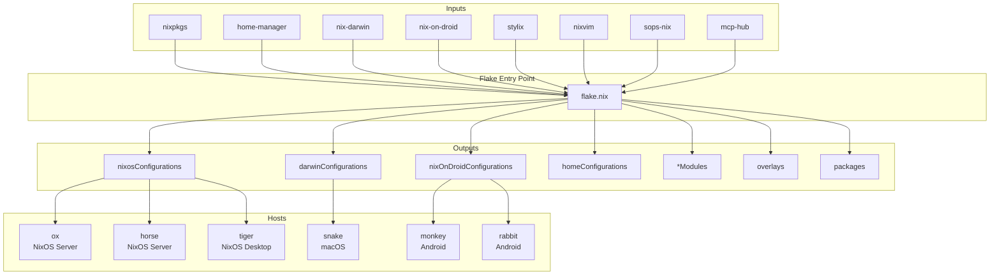

### Platform Distribution

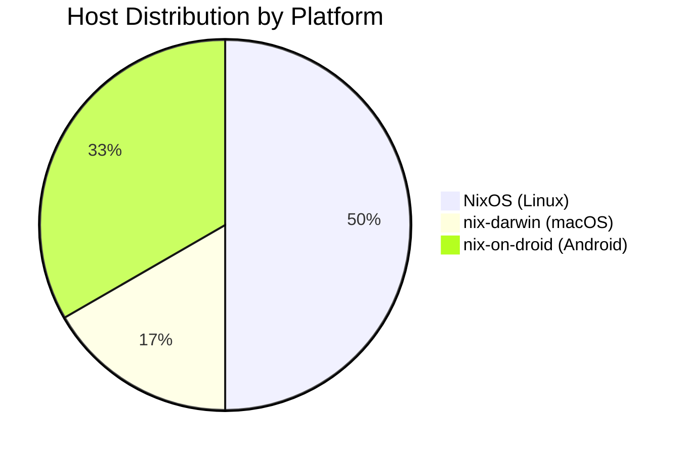

---

## Flake Architecture

### Input Dependencies

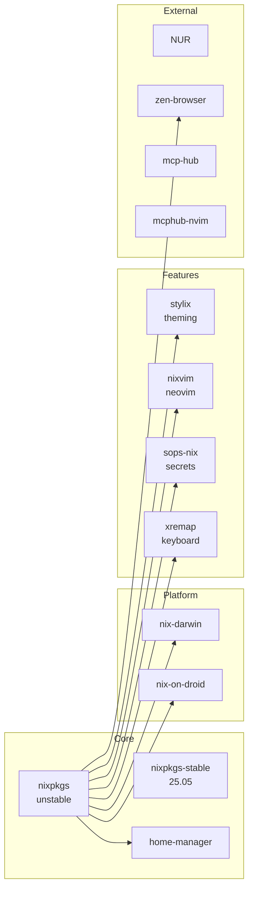

### Flake Outputs Structure

```nix
outputs = {
  # Global username
  username = "idjo";

  # Package outputs
  packages = { ... };        # Custom packages per system
  formatter = { ... };       # nixfmt per system
  overlays = { ... };        # Package overlays

  # Module outputs (auto-imported by hosts)
  nixosModules = { ... };
  homeManagerModules = { ... };
  darwinModules = { ... };
  nixOnDroidModules = { ... };

  # Configuration outputs
  nixosConfigurations = {
    ox = { ... };
    horse = { ... };
    tiger = { ... };
  };

  darwinConfigurations = {
    snake = { ... };
  };

  nixOnDroidConfigurations = {
    monkey = { ... };
    rabbit = { ... };
  };

  homeConfigurations = {
    "idjo@ox" = { ... };
    "idjo@horse" = { ... };
    "idjo@tiger" = { ... };
    "idjo@snake" = { ... };
  };
};
```

---

## Module System

### Module Hierarchy

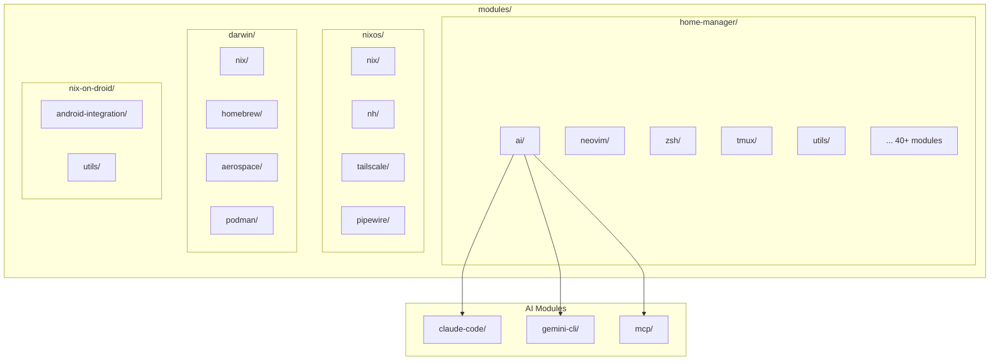

### Module Enable Pattern

Every module follows this consistent structure:

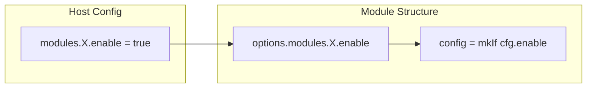

**Implementation Pattern:**

```nix
{ lib, config, pkgs, ... }:
let
  cfg = config.modules.mymodule;
in
{
  # 1. Declare options under modules namespace
  options.modules.mymodule = {
    enable = lib.mkEnableOption "mymodule";

    # Optional: additional configuration options
    setting = lib.mkOption {
      type = lib.types.str;
      default = "value";
      description = "Description of setting";
    };
  };

  # 2. Configuration only applied when enabled
  config = lib.mkIf cfg.enable {
    # Actual configuration here
    home.packages = [ pkgs.somepackage ];

    programs.someprogram = {
      enable = true;
      setting = cfg.setting;
    };
  };
}
```

### Module Auto-Import Chain

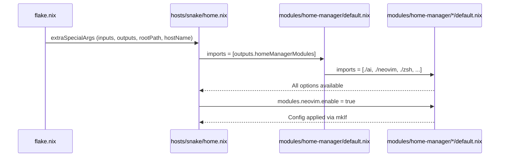

---

## Host Configuration Flow

### NixOS Host Build Flow

```mermaid
flowchart TB
    subgraph "Build Command"
        CMD[nh os switch ~/dotfiles]
    end

    subgraph "Flake Resolution"
        FN[flake.nix]
        NC[nixosConfigurations.hostname]
    end

    subgraph "Host Config"
        HC[hosts/hostname/config.nix]
        HW[hardware-config.nix]
    end

    subgraph "Modules"
        NM[nixosModules]
        SM[System modules applied]
    end

    subgraph "Home Manager"
        HMC[home.nix]
        HMM[homeManagerModules]
        UM[User modules applied]
    end

    subgraph "Result"
        SYS[/etc/nixos/configuration]
        USER[~/.config/*]
    end

    CMD --> FN
    FN --> NC
    NC --> HC
    HC --> HW
    HC --> NM
    NM --> SM

    HC -.->|"home-manager.users.idjo"| HMC
    HMC --> HMM
    HMM --> UM

    SM --> SYS
    UM --> USER
```

### Special Args Propagation

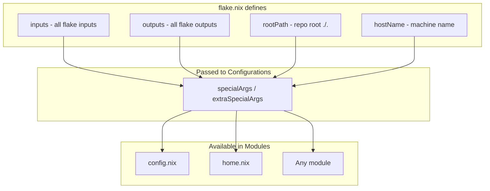

---

## Cross-Platform Abstractions

### Platform Detection Pattern

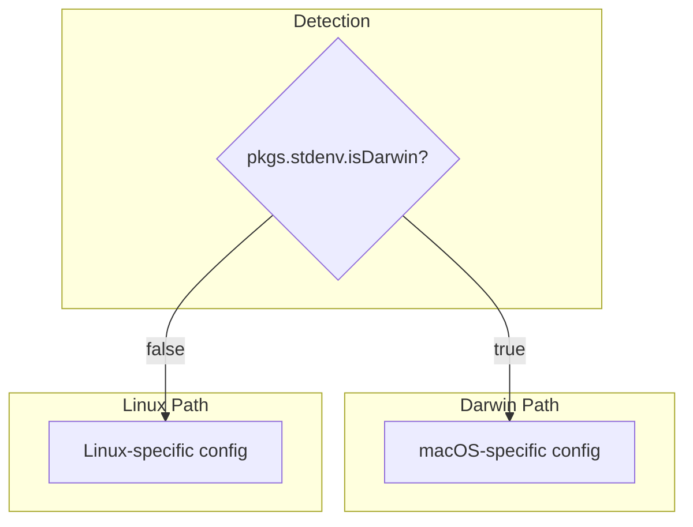

**Examples in Code:**

```nix
# Rebuild command alias
rebuild = if pkgs.stdenv.isDarwin
  then "${pkgs.nh}/bin/nh darwin switch ~/Dotfiles"
  else "${pkgs.nh}/bin/nh os switch";

# Tmux prefix key
prefix = if pkgs.stdenv.isDarwin && config.programs.ghostty.enable
  then "ƒ"
  else "M-f";

# Playwright browser path
executablePath = if pkgs.stdenv.isDarwin
  then "${pkgs.playwright-driver.browsers}/chromium-.../chrome-mac-arm64/..."
  else "${pkgs.playwright-driver.browsers}/chromium-.../chrome-linux/chrome";
```

### Module Availability by Platform

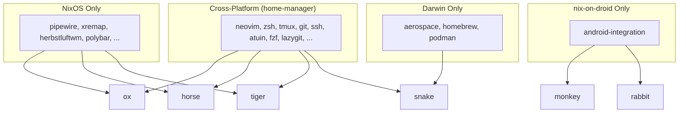

---

## Overlay System

### Overlay Types and Flow

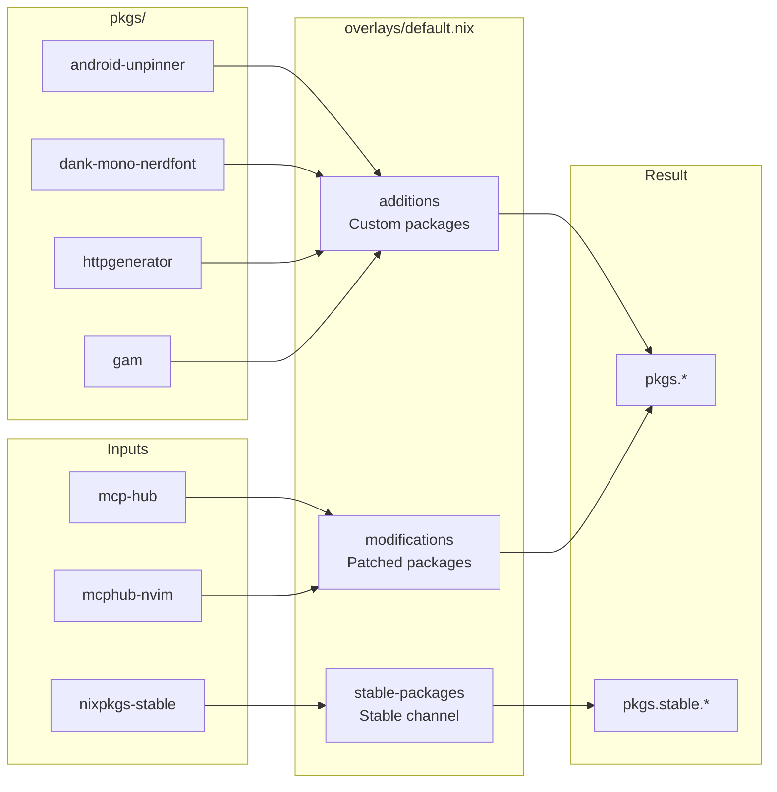

### Overlay Implementation

```nix
# overlays/default.nix
{ inputs }:
{
  # Custom packages from pkgs/ directory
  additions = final: _prev: import ../pkgs final.pkgs;

  # Modified/patched upstream packages
  modifications = final: prev: {
    mcp-hub = inputs.mcp-hub.packages.${prev.stdenv.hostPlatform.system}.default;
    mcphub-nvim = inputs.mcphub-nvim.packages.${prev.stdenv.hostPlatform.system}.default;
  };

  # Access stable channel via pkgs.stable.*
  stable-packages = final: _prev: {
    stable = import inputs.nixpkgs-stable {
      system = final.system;
      config.allowUnfree = true;
    };
  };
}
```

---

## Secret Management

### SOPS Architecture

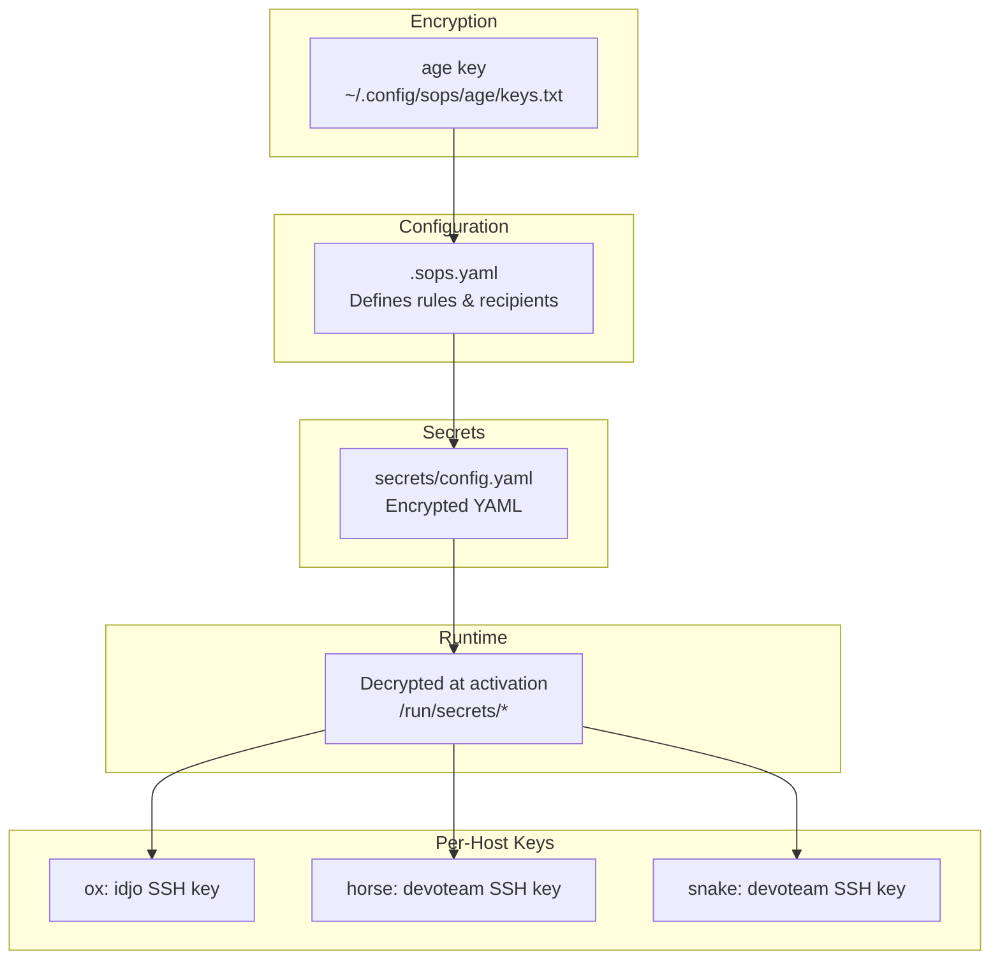

### Host-Specific Secret Selection

```nix
# In sops module
let
  sshKey = {
    ox = "idjo";
    horse = "devoteam";
    snake = "devoteam";
  }."${hostName}";
in
{
  sops.secrets."ssh/${sshKey}" = {
    sopsFile = "${rootPath}/secrets/config.yaml";
    path = "${config.home.homeDirectory}/.ssh/id_ed25519";
  };
}
```

---

## Neovim Plugin Architecture

### Plugin Organization

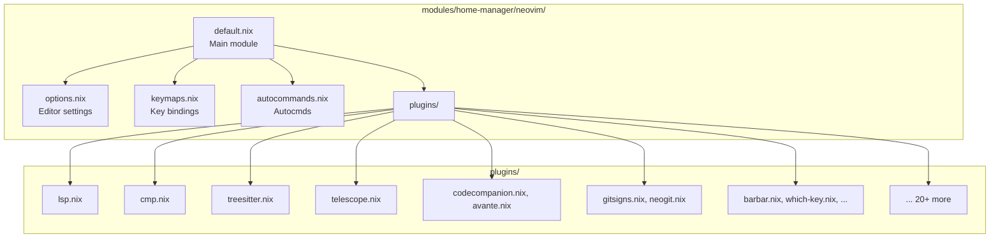

---

## AI/MCP Integration

### Claude Code Architecture

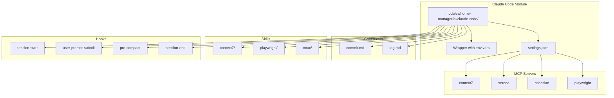

---

## Build & Deployment Flow

### Complete Build Pipeline

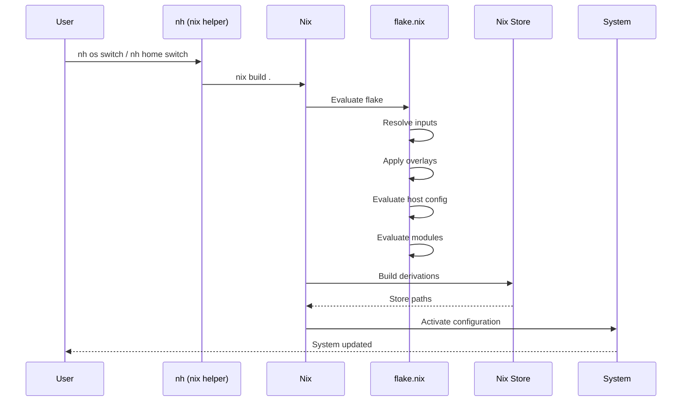

---

## Summary

This architecture enables:

1. **Unified Configuration**: Single source of truth for all machines
2. **Cross-Platform Support**: Same modules work across NixOS, macOS, and Android
3. **Modular Design**: 60+ independent, composable modules
4. **Type-Safe Options**: All configuration is validated at build time
5. **Reproducible Builds**: Flake lock ensures consistent builds
6. **Secret Management**: SOPS integration with per-host key selection
7. **Easy Extension**: Well-defined patterns for adding hosts and modules
